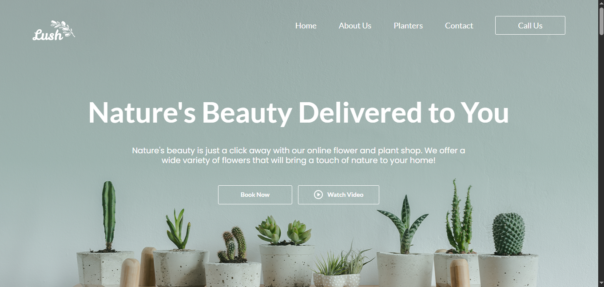

# 🌿 LUSH GARDEN – Pixel Perfect Figma to Code Website

**Lush Garden** is a fully responsive, **pixel-perfect website** designed and built from a **Figma prototype** during my internship at **Revnix**.  
I independently handled the entire development process — from layout structuring to responsive optimization — ensuring high-quality design conversion.

---

## 🚀 Live Demo  
👉 [Live Website Link]()  

---

## 🖼️ Preview  


---

## 💡 Project Overview  

This website represents a **modern floral and plant shop landing page**, crafted with care to maintain **pixel-perfect accuracy** to the Figma design.  
It demonstrates professional front-end development practices, including **semantic HTML**, **responsive CSS**, and **interactive JavaScript**.

🎨 **Figma Design:** [View on Figma](https://www.figma.com/design/FpZVNaCVhGIDqahMjMmYaS/homepage--Community-?node-id=0-405&t=FaYSTHOjP2onqPPG-0)

---

## ✨ Key Features  

- 🌸 **Pixel-perfect** Figma to Code conversion  
- 📱 **Fully responsive** for all devices  
- 🧭 **Smooth navbar** with hamburger menu for mobile  
- 🪴 **Dynamic product grid** with hover and action buttons  
- 💬 **Testimonials, Gallery, and Blog** sections for user engagement  
- 📨 **Newsletter form** with validation  
- 💚 **Clean, maintainable, and scalable CSS architecture**

---

## 🗂️ Folder Structure  
 
```
LUSH-GARDEN/
│
├── index.html              # Main HTML file
├── css/
│   └── style.css           # Website styling
│
├── js/
│   └── script.js           # Navigation and interactivity logic
│
├── images/
│   ├── homepage.png        # Homepage screenshot
│   └── other-assets.png
│
└── README.md               # Project documentation
```

---

## 🛠️ Built With  

| Technology | Purpose |
|-------------|----------|
| **HTML5** | Semantic structure |
| **CSS3 (Flexbox & Grid)** | Styling & responsiveness |
| **JavaScript (ES6)** | Navbar toggle & UI interactivity |
| **Google Fonts (Lato, Manrope, Raleway, Poppins)** | Typography |
| **Font Awesome / Ionicons** | Icons & visuals |

---

## ⚙️ How to Run Locally  

1. Clone this repository:  
   ```bash
   git clone https://github.com/UmarKhan-codeer/Lush-Garden.git
   ```

2. Navigate to the project folder:  
   ```bash
   cd Lush-Garden
   ```

3. Open the website in your browser:  
   ```bash
   start index.html
   ```

---

## 👨‍💻 Author  

**Umar Khan**  
💼 Front-End Developer (Intern @ Revnix)  
📧 [your-email@example.com](mailto:your-email@example.com)  
🌐 [Portfolio Link](https://portfolio-umer-pro.vercel.app/)

---

## 📄 License  
This project is open-source under the **MIT License**.

---

## ⭐ Acknowledgments  

- Design inspired by **Figma Boldo Template**  
- Icons: [Font Awesome](https://fontawesome.com/)  
- Fonts: [Google Fonts](https://fonts.google.com/)  
